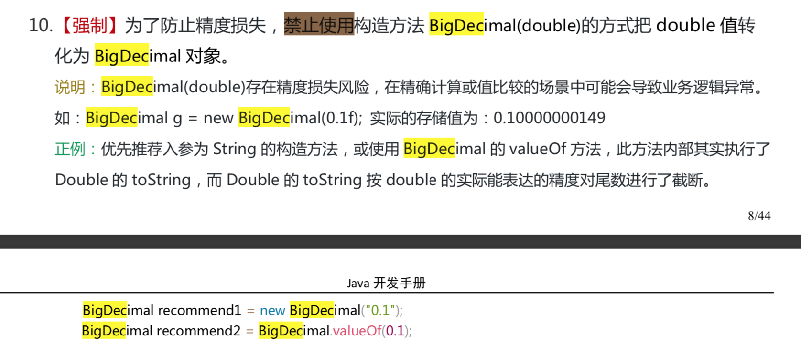

##  BigDecimal

### 1. BigDecimal 的用处

《阿里巴巴Java开发手册》中提到：**浮点数之间的等值判断，基本数据类型不能用==来比较，包装数据类型不能用 equals 来判断。** 具体原理和浮点数的编码方式有关，这里就不多提了，我们下面直接上实例：

```java
float a = 1.0f - 0.9f;
float b = 0.9f - 0.8f;
System.out.println(a);// 0.100000024
System.out.println(b);// 0.099999964
System.out.println(a == b);// false
```

具有基本数学知识的我们很清楚的知道输出并不是我们想要的结果（**精度丢失**），我们如何解决这个问题呢？一种很常用的方法是：**使用使用 BigDecimal 来定义浮点数的值，再进行浮点数的运算操作。**

```java
BigDecimal a = new BigDecimal("1.0");
BigDecimal b = new BigDecimal("0.9");
BigDecimal c = new BigDecimal("0.8");
BigDecimal x = a.subtract(b);// 0.1
BigDecimal y = b.subtract(c);// 0.1
System.out.println(x.equals(y));// true 
```

### 2. BigDecimal 的大小比较

`a.compareTo(b)` : 返回 -1 表示小于，0 表示 等于， 1表示 大于。

```java
BigDecimal a = new BigDecimal("1.0");
BigDecimal b = new BigDecimal("0.9");
System.out.println(a.compareTo(b));// 1
```

### 3. BigDecimal 保留几位小数

通过 `setScale`方法设置保留几位小数以及保留规则。保留规则有挺多种，不需要记，IDEA会提示。

```java
BigDecimal m = new BigDecimal("1.255433");
BigDecimal n = m.setScale(3,BigDecimal.ROUND_HALF_DOWN);
System.out.println(n);// 1.255
```

### 4. BigDecimal 的使用注意事项

注意：我们在使用BigDecimal时，为了防止精度丢失，推荐使用它的 **BigDecimal(String)** 构造方法来创建对象。《阿里巴巴Java开发手册》对这部分内容也有提到如下图所示。



### 5. 总结

1. BigDecimal 主要用来操作（大）浮点数，BigInteger 主要用来操作大整数（超过 long 类型）。
2. 在需要精确的小数计算时再使用BigDecimal，BigDecimal的性能比double和float差，在处理庞大，复杂的运算时尤为明显。故一般精度的计算没必要使用BigDecimal。
3. 尽量使用参数类型为String的构造函数。
4. BigDecimal都是不可变的（immutable）的， 在进行每一次四则运算时，都会产生一个新的对象 ，所以在做加减乘除运算时要记得要保存操作后的值。

