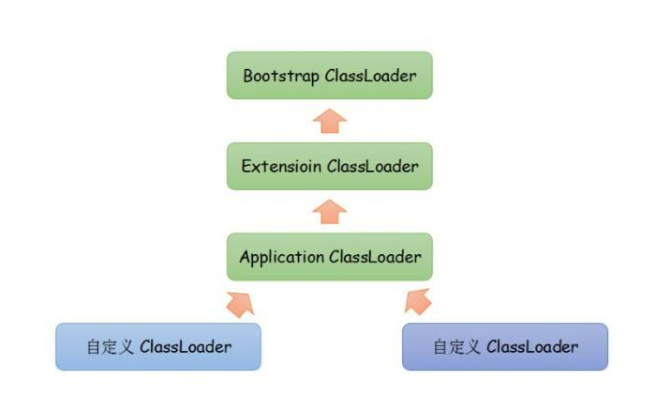
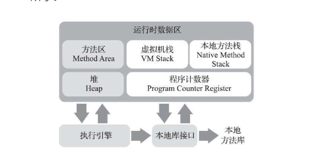

# 1.概述

跨平台的是 Java 程序，而不是 JVM。JVM 是用 C/C++ 开发的，是编译后的机器码，不能跨平台，不同平台下需要安装不同版本的 JVM。

## 1.JVM介绍

JVM，即JavaVirtual Machine，**java虚拟机**。它是一个虚构出来的计算机，是通过在实际的计算机上仿真模拟各种计算机功能来实现的。

我们编写的java源码，编译后会生成一种.class文件，成为字节码文件。java虚拟机（jvm）就是负责将字节码文件翻译成特定平台下的机器代码然后运行。也就是说，只要在不同的平台上安装对应的JVM，就可以运行字节码文件，运行我们编写的java程序。

在这个过程，我们编写的java程序没有做出任何改变，仅仅通过jvm这一“中间层”，就能在不同的硬件上运行，真正实现了“一次编译，到处运行”的目的。

jvm是运行在操作系统之上的，没有与硬件直接的交互。

## 2.JVM组成

1. 类加载器：在JVM启动时或者运行时将需要的class加载到JVM。
2. 执行引擎：执行引擎的任务是负责执行class文件包含的字节码指令，相当于实际机器上的CPU。
3. 内存区：将内存划分为若干个区以模拟实际机器上的存储、记录和调度功能模块，如实际机器上的各种功能的寄存器或者PC指针的记录器等。
4. 本地方法调用：调用C或者C++实现的本地方法的代码返回结果。

### 2.1类加载器

类加载器（class loader）用来加载java类到java虚拟机中。一般来说，java虚拟机使用java类的方法如下：

java源文件（.java文件）在经过java**编译器**编译之后就被转换成java字节代码（.class文件）；**类加载器**负责读取java字节代码，并转换成java.lang.Class类的一个实例。

### 类加载器的加载过程

从类被加载到虚拟机内存中开始，到释放内存总共有7个步骤：加载，验证，准备，解析，初始化，使用，卸载。其中**验证，准备，解析三个部分统称为连接**

#### 2.1.1 加载

1. 将class文件加载到内存
2. 将静态数据结构转化成方法区中运行时的数据结构
3. 在堆中生成一个代表这个类的 java.lang.Class对象作为数据访问的入口

#### 2.1.2 链接

1. 验证：确保加载的类符合 JVM 规范和安全，保证被校验类的方法在运行时不会做出危害虚拟机的事件，其实就是一个安全检查
2. 准备：为static变量在方法区中分配内存空间，设置变量的初始值，例如 static int a = 3 （注意：准备阶段只设置类中的静态变量（方法区中），不包括实例变量（堆内存中），实例变量是对象初始化时赋值的）
3. 解析：虚拟机将常量池内的符号引用替换为直接引用的过程（符号引用比如我现在import java.util.ArrayList这就算符号引用，直接引用就是指针或者对象地址，注意引用对象一定是在内存进行）

#### 2.1.3 初始化

初始化其实就是一个赋值的操作，它会执行一个类构造器的<<clinit>clinit>()方法。由编译器自动收集类中所有变量的赋值动作，此时准备阶段时的那个 static int a = 3 的例子，在这个时候就正式赋值为3

#### 2.1.4 卸载

GC将无用对象从内存中卸载

### 2.2 类加载器的加载顺序

加载一个Class类的顺序也是有优先级的，类加载器从最底层开始往上的顺序是这样的

1. BootStrap ClassLoader：rt.jar
2. Extention ClassLoader: 加载扩展的jar包
3. App ClassLoader：指定的classpath下面的jar包
4. Custom ClassLoader：自定义的类加载器

### 2.3 双亲委派机制

当一个类收到了加载请求时，它是不会先自己去尝试加载的，而是委派给父类去完成，比如我现在要new一个Person，这个Person是我们自定义的类，如果我们要加载它，就会先委派App ClassLoader，只有当父类加载器都反馈自己无法完成这个请求（也就是父类加载器都没有找到加载所需的Class）时，子类加载器才会自行尝试加载

这样做的好处是，加载位于rt.jar包中的类时不管是哪个加载器加载，最终都会委托到BootStrap ClassLoader进行加载，这样保证了使用不同的类加载器得到的都是同一个结果。

其实这个也是一个隔离的作用，避免了我们的代码影响了JDK的代码，比如我现在要来一个

```
public class String(){
    public static void main(){sout;}
}
```

这种时候，我们的代码肯定会报错，因为在加载的时候其实是找到了rt.jar中的String.class，然后发现这也没有main方法

## 3.双亲委派机制

类的加载过程采用的双亲委派机制，这种机制能更好的保证java平台的安全性。



### 工作过程

1. 当前$ClassLoader$首先从自己已经加载的类中查询此类是否已经加载，如果已经加载则直接返回原来已经加载类。

   每个类加载器都有自己的加载缓存，当一个类被加载了以后就会放入缓存，等下次加载的时候就可以直接返回。

2. 当前$ClassLoader$的缓存中没有找到被加载的类的时候，委托父类加载器去加载，父类加载器采用同样的策略，首先查看自己的缓存，然后委托父类的父类去加载，一直到$bootstrap ClassLoader$

   当所有的父类加载器都没有加载到时候，再由当前的类加载器加载，并将其放入它自己的缓存中，以便下次有加载请求的时候直接返回。

### 设计原因

可以避免用户自己编写的类动态替换java的一些核心类，比如String，同时也避免了重复加载，因为jvm中区分不同类，不仅仅是根据类名，相同的class文件被不同的$ClassLoader$加载就是不同的两个类，如果相互转型的话会抛$java.lang.ClassCaseException$。

不管哪个加载器加载这个类，最终都是委托顶层的启动类进行加载，保证了**使用不同的类加载容器最终得到的都是同一个对象。**

# 2.JVM内存管理

## 1.JVM内存划分



### 方法区

各个线程共享的一个区域，用于存储虚拟机加载的类信息、常量、静态变量、即时编译器编译后的代码等数据。虽然java虚拟机规范把方法区描述为堆的一个逻辑部分，但是它却有一个别名叫做Non-Heap（非堆），目的应该是与java堆区分开来。

#### 永久代 (PermGen) 替换为元空间 (MetaSpace) 

1. 整个永久代有一个 JVM 本身设置固定大小上限，无法进行调整，而元空间使用的是直接内存，受本机可用内存的限制，虽然元空间仍旧可能溢出，但是比原来出现的几率会更小。

> 当你元空间溢出时会得到如下错误： `java.lang.OutOfMemoryError: MetaSpace`

你可以使用 `-XX：MaxMetaspaceSize` 标志设置最大元空间大小，默认值为 unlimited，这意味着它只受系统内存的限制。`-XX：MetaspaceSize` 调整标志定义元空间的初始大小如果未指定此标志，则 Metaspace 将根据运行时的应用程序需求动态地重新调整大小。  

2. 元空间里面存放的是类的元数据，这样加载多少类的元数据就不由 `MaxPermSize` 控制了, 而由系统的实际可用空间来控制，这样能加载的类就更多了。  
3. 在 JDK8，合并 HotSpot 和 JRockit 的代码时, JRockit 从来没有一个叫永久代的东西, 合并之后就没有必要额外的设置这么一个永久代的地方了。

#### 永久代

指内存的永久保存区域，主要存放 Class 和 Meta（元数据）的信息，Class 在被加载的时候被放入永久区域， 它和和存放实例的区域不同,GC 不会在主程序运行期对永久区域进行清理。所以这也导致了永久代的区域会随着加载的 Class 的增多而胀满，最终抛出 OOM 异常。

### 运行时常量池

是方法区的一部分，用于存放编译器生成的各种字面量和符号引用。

### 堆内存（线程共享）

所有线程共享的一块区域，垃圾收集器管理的主要区域。目前主要的垃圾回收算法都是分代收集算法。

所以 Java 堆中还可以细分为：新生代和老年代；再细致一点的有 Eden 空间、From Survivor 空间、To Survivor 空间等，默认情况下新生代按照8:1:1的比例来分配。根据 Java 虚拟机规范的规定，Java 堆可以处于物理上不连续的内存空间中，只要逻辑上是连续的即可，就像我们的磁盘一样。

> Java堆既可以被实现成固定大小的，也可以是可扩展的，不过当前主流的Java虚拟机都是按照可扩展来实现的（通过参数-Xmx和-Xms设定）。如果在Java堆中没有内存完成实例分配，并且堆也无法再扩展时，Java虚拟机将会抛出OutOfMemoryError异常。

#### 新生代

是用来存放新生的对象。一般占据堆的 1/3 空间。由于频繁创建对象，所以新生代会频繁触发
MinorGC 进行垃圾回收。新生代又分为 Eden 区、 ServivorFrom、 ServivorTo 三个区。

1. Eden 区
   Java 新对象的出生地（如果新创建的对象占用内存很大，则直接分配到老
   年代）。当 Eden 区内存不够的时候就会触发 MinorGC，对新生代区进行
   一次垃圾回收。
2. ServivorFrom
   上一次 GC 的幸存者，作为这一次 GC 的被扫描者。
3. ServivorTo
   保留了一次 MinorGC 过程中的幸存者。
4. MinorGC 的过程（复制->清空->互换）
   MinorGC 采用复制算法。
   * eden、 servicorFrom 复制到 ServicorTo，年龄+1
     首先，把 Eden 和 ServivorFrom 区域中存活的对象复制到 ServicorTo 区域（如果有对象的年
     龄以及达到了老年的标准，则赋值到老年代区），同时把这些对象的年龄+1（如果 ServicorTo 不
     够位置了就放到老年区）；
   * 清空 eden、 servicorFrom
     然后，清空 Eden 和 ServicorFrom 中的对象；
   *  ServicorTo 和 ServicorFrom 互换
     最后， ServicorTo 和 ServicorFrom 互换，原 ServicorTo 成为下一次 GC 时的 ServicorFrom
     区。 

#### 老年代

主要存放应用程序中生命周期长的内存对象。

1. 老年代的对象比较稳定，所以 MajorGC 不会频繁执行。在进行 MajorGC 前一般都先进行了一次 MinorGC，使得有新生代的对象晋身入老年代，导致空间不够用时才触发。当无法找到足够大的连续空间分配给新创建的较大对象时也会提前触发一次 MajorGC 进行垃圾回收腾出空间。

2. MajorGC 采用标记清除算法：

   首先扫描一次所有老年代，标记出存活的对象，然后回收没有标记的对象。 MajorGC 的耗时比较长，因为要扫描再回收。 MajorGC 会产生内存碎片，为了减少内存损耗，我们一般需要进行合并或者标记出来方便下次直接分配。当老年代也满了装不下的时候，就会抛出 OOM（Out of Memory）异常。 

### 程序计数器

java线程私有，类似于操作系统里的PC计数器，它可以看做是当前线程执行的字节码的行号指示器。

>由于Java虚拟机的多线程是通过线程轮流切换、分配处理器执行时间的方式来实现的，在任何一个确定的时刻，一个处理器（对于多核处理器来说是一个内核）都只会执行一条线程中的指令。因此，为了线程切换后能恢复到正确的执行位置，每条线程都需要有一个独立的程序计数器，各条线程之间计数器互不影响，独立存储，我们称这类内存区域为“线程私有”的内存。

如果线程正在执行的是一个java方法，这个计数器记录的是正在执行的虚拟机字节码指令的地址；如果正在执行的是Native方法，这个计数器则为空（$Undefined$）。此内存区域是唯一一个在java虚拟机规范中没有规定任何$OutOfMemoryError $情况的区域。

### 虚拟机栈（栈内存）

java线程私有，虚拟机栈描述的是java方法执行的内存模型：每个方法在执行的时候，都会创建一个栈帧用于存储局部变量、操作数、动态链接、方法出口等信息；每个方法调用都意味着一个栈帧在虚拟机栈中入栈到出栈的过程。

### 本地方法栈

和java虚拟机栈的作用类似，区别是该区域为JVM提供使用native方法的服务。

## 2.对象分配规则

对象优先分配在Eden区，如果Eden区没有足够的空间时，虚拟机执行一次Minor GC。

大对象直接进入老年代（大对象指的是大量连续内存空格键的对象）。这样做的目的就是避免在Eden区及两个Survivor区之间来回复制，产生大量的内存复制操作。（新生代采取复制算法收集内存）。

长期存活的对象进入老年代。虚拟机为每个对象定义了一个年龄计算器，如果对象经历了1次Minor GC 那么对象会进入Survivor区，之后每经历一次 Minor GC 那么对象加1，直到达到阀值对象进入老年区。

动态判断对象的年龄，如果Survivor区中相同年龄的对象大小的综合大于Survivor空间的一般，年龄大于或等于该年龄的对象可以直接进入老年代。

### -Xms、-Xmx的含义

JVM初始分配的内存由-Xms指定，默认是物理内存的1/64

JVM最大分配的内存由-Xmx指定，默认是物理内存的1/4

默认空余堆内存小于40%时，JVM就会增大堆知道-Xmx的最大限制；空余堆内存大于70%时，JVM会减少堆知道-Xms的最小限制。

因此服务器一般设置-Xms、-Xmx相等以避免在每次GC后调整堆的大小。对象的堆内存由称为垃圾回收器的自动内存管理系统回收。

# 3.GC

## 1.判断一个对象是否可被回收

### **引用计数算法**

每个对象有一个引用计数属性，新增一个引用计数加1，删除一个引用则减少一个计数。垃圾回收时，只用手机计数为0的对象。

在两个对象出现循环引用的情况下，此时引用计数器永远不为 0，导致无法对它们进行回收。正是因为循环引用的存在，因此 Java 虚拟机不使用引用计数算法。

### 可达性分析算法

从GC Roots开始向下搜索，搜索所走过的路径称为引用链。当一个对象到GC Roots没有任何引用链相连时，则证明此对象是不可用的，不可达对象。

## 2.垃圾回收算法

### 标记-清除

在标记阶段，程序会检查每个对象是否为活动对象，如果是活动对象，则程序会在对象头部打上标记。

在清除阶段，会进行对象回收并取消标志位，另外，还会判断回收后的分块与前一个空闲分块是否连续，若连续，会合并这两个分块。回收对象就是把对象作为分块，连接到称为“空闲链表”的单向链表，之后进行分配时只需要遍历这个空闲链表，就可以找到分块。

在分配时，程序会搜索空闲链表寻找空间大于等于新对象大小size的块block，如果它找到的块等于size，会直接返回这个分块；如果找的的块大于size，会将块分割成大小为size与（block-size）的两部分，返回大小为size的分块，并把大小为（block-size）的块返回给空闲链表。

**不足**

* 标记和清除过程的效率都不高；
* 会产生大量不连续的内存碎片，导致无法给大对象分配内存。

### 标记-整理

让所有存活的对象都向一端移动，然后直接清理掉边界以外的内存。

**优点**

不会产生内存碎片

**不足**

需要移动大量对象，处理效率比较低。

### 复制

将内存划分为大小相等的两块，每次只使用其中一块，当这一块内存用完了就将还存货的对象复制到另一块上面，然后再把使用过的内存空间进行一次清理。

**不足**

只使用了内存的一半

### 分代收集

一般将堆分为新生代和老年代

* 新生代使用：复制算法
* 老年代使用：“标记-清除”或者“标记-整理”

# 4.JAVA 四中引用类型

## 强引用

在 Java 中最常见的就是强引用， 把一个对象赋给一个引用变量，这个引用变量就是一个强引用。当一个对象被强引用变量引用时，它处于可达状态，它是不可能被垃圾回收机制回收的，即使该对象以后永远都不会被用到 JVM 也不会回收。因此强引用是造成 Java 内存泄漏的主要原因之一。

## 软引用

软引用需要用 SoftReference 类来实现，对于只有软引用的对象来说，当系统内存足够时它不会被回收，当系统内存空间不足时它会被回收。软引用通常用在对内存敏感的程序中。

## 弱引用

弱引用需要用 WeakReference 类来实现，它比软引用的生存期更短，对于只有弱引用的对象来说，只要垃圾回收机制一运行，不管 JVM 的内存空间是否足够，总会回收该对象占用的内存。

## 虚引用

虚引用需要 PhantomReference 类来实现，它不能单独使用，必须和引用队列联合使用。 虚引用的主要作用是跟踪对象被垃圾回收的状态。 