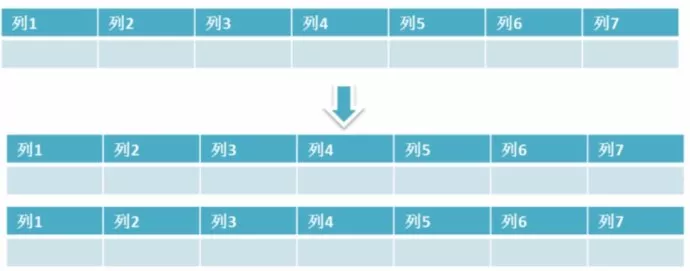

# 1.大表优化

当MySQL单表记录数过大时，数据库的CRUD性能会明显下降，一些常见的优化措施如下：

## 1. 限定数据的范围

务必禁止不带任何限制数据范围条件的查询语句。比如：我们当用户在查询订单历史的时候，我们可以控制在一个月的范围内；

## 2. 读/写分离

主从同步。经典的数据库拆分方案，主库负责写，从库负责读；

注意点：

​	存储引擎的选择

​	存储引擎的选择原因

## 3. 垂直分区

**根据数据库里面数据表的相关性进行拆分。** 例如，用户表中既有用户的登录信息又有用户的基本信息，可以将用户表拆分成两个单独的表，甚至放到单独的库做分库。

**简单来说垂直拆分是指数据表列的拆分，把一张列比较多的表拆分为多张表。** 如下图所示，这样来说大家应该就更容易理解了。

数据库垂直分区

- **垂直拆分的优点：** 可以使得列数据变小，在查询时减少读取的Block数，减少I/O次数。此外，垂直分区可以简化表的结构，易于维护。
- **垂直拆分的缺点：** 主键会出现冗余，需要管理冗余列，并会引起Join操作，可以通过在应用层进行Join来解决。此外，垂直分区会让事务变得更加复杂；

## 4. 水平分区

**保持数据表结构不变，通过某种策略存储数据分片。这样每一片数据分散到不同的表或者库中，达到了分布式的目的。 水平拆分可以支撑非常大的数据量。**

水平拆分是指数据表行的拆分，表的行数超过200万行时，就会变慢，这时可以把一张的表的数据拆成多张表来存放。举个例子：我们可以将用户信息表拆分成多个用户信息表，这样就可以避免单一表数据量过大对性能造成影响。

数据库水平拆分

水平拆分可以支持非常大的数据量。需要注意的一点是：分表仅仅是解决了单一表数据过大的问题，但由于表的数据还是在同一台机器上，其实对于提升MySQL并发能力没有什么意义，所以 **水平拆分最好分库** 。

水平拆分能够 **支持非常大的数据量存储，应用端改造也少**，但 **分片事务难以解决** ，跨节点Join性能较差，逻辑复杂。《Java工程师修炼之道》的作者推荐 **尽量不要对数据进行分片，因为拆分会带来逻辑、部署、运维的各种复杂度** ，一般的数据表在优化得当的情况下支撑千万以下的数据量是没有太大问题的。如果实在要分片，尽量选择客户端分片架构，这样可以减少一次和中间件的网络I/O。

**下面补充一下数据库分片的两种常见方案：**

- **客户端代理：** **分片逻辑在应用端，封装在jar包中，通过修改或者封装JDBC层来实现。** 当当网的 **Sharding-JDBC** 、阿里的TDDL是两种比较常用的实现。
- **中间件代理：** **在应用和数据中间加了一个代理层。分片逻辑统一维护在中间件服务中。** 我们现在谈的 **Mycat** 、360的Atlas、网易的DDB等等都是这种架构的实现。

# 2.sql优化

## sql慢的原因

1. 查询语句写的烂；
2. 索引失效；
3. 关联查询有太多的join；
4. 服务器调优及各个参数设置。

## 优化

1.对查询进行优化，应尽量避免全表扫描，首先应考虑在 where 及 order by 涉及的列上建立索引

2.应尽量避免在 where 子句中对字段进行 null 值判断，否则将导致引擎放弃使用索引而进行全表扫描，如：   

select id from t where num is null   

可以在num上设置默认值0，确保表中num列没有null值，然后这样查询：    

select id from t where num=0   

3.应尽量避免在 where 子句中使用!=或<>操作符，否则将引擎放弃使用索引而进行全表扫描。   

4.应尽量避免在 where 子句中使用 or 来连接条件，否则将导致引擎放弃使用索引而进行全表扫描，如：   

select id from t where num=10 or num=20 

可以这样查询：   

select id from t where num=10 

union all     

select id from t where num=20 

5.in 和 not in 也要慎用，否则会导致全表扫描，如：     

select id from t where num in(1,2,3)    

对于连续的数值，能用 between 就不要用 in 了：  select id from t where num between 1 and 3

6.下面的查询也将导致全表扫描：   

select id from t where name like '%abc%'   

7.应尽量避免在 where 子句中对字段进行表达式操作，这将导致引擎放弃使用索引而进行全表扫描。如：   

select id from t where num/2=100  

应改为:  select id from t where num=100*2 

8.应尽量避免在where子句中对字段进行函数操作，这将导致引擎放弃使用索引而进行全表扫描。如

select id from t where substring(name,1,3)='abc'--name以abc开头的id      

应改为:  

select id from t where name like 'abc%' 

9.不要在 where 子句中的“=”左边进行函数、算术运算或其他表达式运算，否则系统将可能无法正确使用索引。 

10.在使用索引字段作为条件时，如果该索引是复合索引，那么必须使用到该索引中的第一个字段作为条件时才能保证系统使用该索引，否则该索引将不会被使用，并且应尽可能的让字段顺序与索引顺序相一致。   

11.不要写一些没有意义的查询，如需要生成一个空表结构：    

select col1,col2 into #t from t where 1=0   

这类代码不会返回任何结果集，但是会消耗系统资源的，应改成这样：   

create table #t(...) 

12.很多时候用 exists 代替 in 是一个好的选择：    

select num from a where num in(select num from b)    

用下面的语句替换：   

select num from a where exists(select 1 from b where num=a.num)     

13.并不是所有索引对查询都有效，SQL是根据表中数据来进行查询优化的，当索引列有大量数据重复时，SQL查询可能不会去利用索引，   

如一表中有字段sex，male、female几乎各一半，那么即使在sex上建了索引也对查询效率起不了作用。   

14.索引并不是越多越好，索引固然可以提高相应的 select 的效率，但同时也降低了 insert 及 update 的效率，      

因为 insert 或 update 时有可能会重建索引，所以怎样建索引需要慎重考虑，视具体情况而定。  

一个表的索引数最好不要超过6个，若太多则应考虑一些不常使用到的列上建的索引是否有必要。   

15.尽量使用数字型字段，若只含数值信息的字段尽量不要设计为字符型，这会降低查询和连接的性能，并会增加存储开销。   

这是因为引擎在处理查询和连接时会逐个比较字符串中每一个字符，而对于数字型而言只需要比较一次就够了。   

16.尽可能的使用 varchar 代替 char ，因为首先变长字段存储空间小，可以节省存储空间， 

其次对于查询来说，在一个相对较小的字段内搜索效率显然要高些。      

17.任何地方都不要使用 select * from t ，用具体的字段列表代替“*”，不要返回用不到的任何字段

18.避免频繁创建和删除临时表，以减少系统表资源的消耗。

19.临时表并不是不可使用，适当地使用它们可以使某些例程更有效，例如，当需要重复引用大型表或常用表中的某个数据集时。但是，对于一次性事件，最好使用导出表。        

20.在新建临时表时，如果一次性插入数据量很大，那么可以使用 select into 代替 create table，避免造成大量 log ，以提高速度；如果数据量不大，为了缓和系统表的资源，应先create table，然后insert。

21.如果使用到了临时表，在存储过程的最后务必将所有的临时表显式删除，先 truncate table ，然后 drop table ，这样可以避免系统表的较长时间锁定。   

22.尽量避免使用游标，因为游标的效率较差，如果游标操作的数据超过1万行，那么就应该考虑改写。 

23.使用基于游标的方法或临时表方法之前，应先寻找基于集的解决方案来解决问题，基于集的方法通常更有效。

24.与临时表一样，游标并不是不可使用。对小型数据集使用 FAST_FORWARD 游标通常要优于其他逐行处理方法，尤其是在必须引用几个表才能获得所需的数据时。

在结果集中包括“合计”的例程通常要比使用游标执行的速度快。如果开发时间允许，基于游标的方法和基于集的方法都可以尝试一下，看哪一种方法的效果更好。

25.尽量避免大事务操作，提高系统并发能力。

26.尽量避免向客户端返回大数据量，若数据量过大，应该考虑相应需求是否合理。 