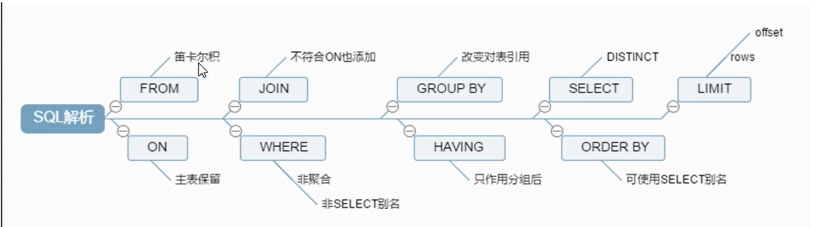

# SQL执行顺序



# 7种join连接

## 内连接

### 内连接文氏图


执行的sql语句以及执行的查询结果

- 执行的sql语句

```mysql
select * from tbl_dept a inner join tbl_emp b on a.id=b.deptId;
```

- 查询结果

  


## 左外连接

### 左外连接文氏图


#### 执行的sql语句以及执行的查询结果

- 执行的sql语句

```csharp
select * from tbl_dept a left join tbl_emp b on a.id=b.deptId;
```

- 查询结果

  


## 右外连接

### 右外连接文氏图


这里写图片描述

#### 执行的sql语句以及执行的查询结果

- 执行的sql语句

```csharp
select * from tbl_dept a right join tbl_emp b on a.id=b.deptId;
```

- 查询结果

  


## 左连接

### 左连接文氏图


#### 执行的sql语句以及执行的查询结果

- 执行的sql语句

```csharp
elect * from tbl_dept a left join tbl_emp b on a.id=b.deptId where b.deptId is null;
```

- 查询结果


## 右连接

### 右连接文氏图


右连接

#### 执行的sql语句以及执行的查询结果

- 执行的sql语句

```csharp
select * from tbl_dept a right join tbl_emp b on a.id=b.deptId where a.id is null;
```

- 查询结果


右连接

## 全连接

### 全连接文氏图


这里写图片描述

#### 执行的sql语句以及执行的查询结果

- 执行的sql语句

```mysql
select * from tbl_dept a right join tbl_emp b on a.id=b.deptId 
union 
select * from tbl_dept a left join tbl_emp b on a.id=b.deptId;
```

- 查询结果

  

  全连接

## 两张表中都没有出现的数据集

### 文氏图


#### 执行的sql语句以及执行的查询结果

- 执行的sql语句

```csharp
select * from tbl_dept a right join tbl_emp b on a.id=b.deptId where a.id is null 
union 
select * from tbl_dept a left join tbl_emp b on a.id=b.deptId where b.deptId is null;
```

- 查询结果

