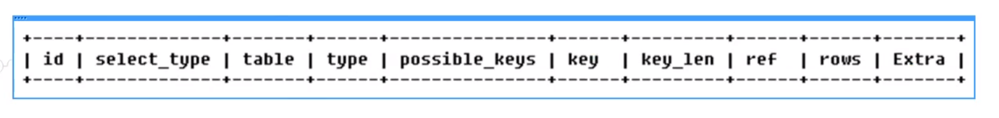

# 1.介绍

Explain+SQL语句

执行计划包含的信息

# 2.能干嘛

* 表的读取顺序
* 数据读取操作的操作类型
* 哪些索引可以被使用
* 哪些索引被实际使用
* 表之间的引用 
* 每张表有多少行被优化器查询

# 3.字段解释

## 1.id

select查询的序列号，包含一组数字，表示查询中的执行select子句或操作表的顺序。

### 三种情况

* id相同，执行顺序由上至下；
* id不同，如果是子查询，id的序号会递增，id值越大优先级越高，越先被执行；
* id相同不同 ，同时存在。

## 2.select_type

### SIMPLE

简单的select查询，查询中不包含子查询或者union

### PRIMARY

查询中包含任何复杂的子部份，最外层查询则被标记

### SUBQUERY

在select合伙where列表中包含了子查询

### DERIVED

在from列表中包含的子查询被标记为derived（衍生）MySQL会递归执行这些子查询，把结果放在临时表中。

### UNION

若第二个select出现在union之后，则被标记为union；若union包含在from子句的子查询中，外层select将被标记为：derived

### UNION RESULT

从union表获取结果的select

## 3.table

显示这一行数据是关于哪张表的

## 4.type

### 类型

all、index、range、ref、eq_ref、const、system、null

### 访问类型排列

显示查询使用了何种类型，从最好到最差依次是：

system>const>eq_ref>ref>range>index>all

> 一般来说，得保证查询至少到达到range级别，最好能达到ref

#### system

表只有一行记录（等于系统表），这是const类型的特例，平时不会出现，这个也可以忽略不计

#### const

表示通过索引一次就找到了，const用于primary key或这unique索引。因为只匹配一行数据，所以很快。

#### eq_ref

唯一性索引扫描，对于每个索引，表中 只有一条记录与之匹配。常见于主键或唯一索引扫描

#### ref

非唯一性索引扫描，返回匹配某个单独值的所有行

本质也是一种索引访问，它返回所有匹配某个单独值的行，然而。它可能会找到多个符合条件的行，所以他应该属于查找和扫描的混合体。

#### range

只检索给定范围的行，使用一个索引来选择行。key列显示使用了哪个索引。

一般就是在你的where语句中出现了between、<、>、in等的查询。

这种范围扫描索引索引扫描比全表扫描要好，因为它只需要开始于索引的某一点，而结束于另一点，不用扫描全年不索引。

#### index

index和all区别为index类型只遍历索引树。这通常比all快，因为索引文件通常比数据文件小。

也就是说虽然all和index都是读全表，但是index是索引中读取的，而all是从硬盘中读的。

#### all

将遍历全表以找到匹配的行

## 4.possible_keys

显示可能运用在这张表中的索引，一个或者多个。

查询涉及到的字段上是否存在索引，则该索引将被列出，但不一定被查询实际使用。

## 5.key

实际使用的索引。如果为null，则没有使用索引。

查询中若使用了覆盖索引，则该索引仅出现在key列表中。

## 6.key_len

表示索引中使用的字节数，可通过该列计算查询中使用的索引的长度。在不损失精确度的情况下，长度越短越好。

key_len显示的值为索引字段的最大可能长度，并非实际使用长度，即key_len是根据表定义计算而得，不是通过表检索而得。

## 7.ref

显示索引的哪一列被使用了，如果可能的话，是一个常数。哪些列或常量被用于查找索引列上的值。

## 8.rows

根据表统计信息及索引选用情况，大致估算出找到所需的记录所需要读取的行数。 

## 9.extra

包含不适合在其他列中显示，但十分重要的额外信息。

> Using filesort
>
> Using temporary
>
> USING index