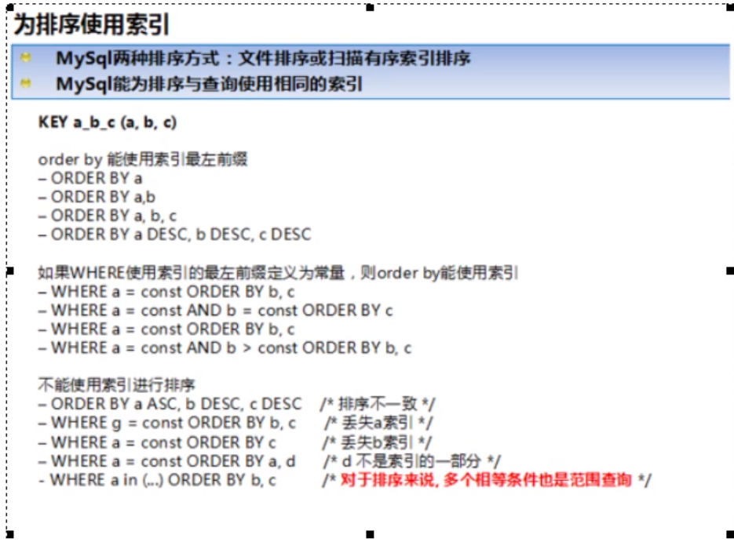

# 步骤：

1. 慢查询的开启并捕获；
2. explain+慢SQL分析；
3. show profile插查询SQL在MySQL服务器里边的执行细节和生命周期情况；
4. SQL数据库服务器的参数调优。

# 1.查询优化

* 永远小表驱动大表

> exists
>
> select * from table where exists(subquery)
>
> 该语法可以理解为：将主查询的数据，放到子查询中做条件验证，根据验证结果（true或者false）来决定主查询的数据结果是否得以保留。

* order by排序优化

  order by子句，尽量使用index方式排序，避免使用FileSort方式排序

  尽可能在索引列上完成排序操作，遵照索引建的最佳左前缀

  

*  group by排序优化

  group by实质是先排序后分组，遵循索引建的最佳左前缀。

  当无法使用索引列，增大max_length_for_sort_data参数的设置+增大sort_buffer_size参数的设置。

  where高于having，能写在where限定的条件久不要去having限定了。

# 2.慢查询日志

## 介绍

* MySQL的慢查询日志是MySQL提供的一种日志记录，它用来记录在MySQL中响应时间超过阀值的语句。
* 具体指运行时间超过long_query_time值的SQL，则会被记录到慢查询日志中。long_query_time的默认值为10，意思是运行10秒以上的语句。
* 由他来查看那些SQL超出了我们的最大忍耐时间值，比如一条sql执行超过5秒中=钟，我们就算慢SQL，希望能收集超过5秒的sql，结合explain进行全面分析。

> 默认情况下，MySQL数据库没有开启慢查询日志，需要我们手动来设置这个参数。
>
> 当然，如果不是调优需要的话，一般不建议启动该参数，因为开启慢查询日志或多或少带来一定的性能影响。慢查询日志支持将日志记录写入文件。

# 3.show profile

