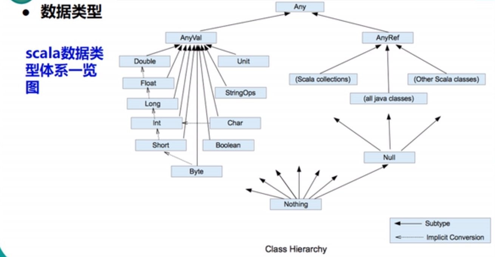

[TOC]

# 1.数据类型

Scala是完全面向对象的语言，所以没有基本数据类型。

Scala的整型常量/字面量默认是Int型，声明Long型常量/字面量须后加‘L ’

* Byte  8bit的有符号数字
* Short 16bit的有符号数字
* Int  32bit的有符号数字
* Long  64bit的有符号数字
* Float  32bit  单精度浮点数
* Double  64双精度浮点数
* Char  16bitUnicode字符
* Boolean  布尔类型
* String  字符串
* Unit  表示无值，和其他语言中的void等同。用作不返回任何结果的方法的结果类型。Unit只有一个实例值，写成（）
* Null  空值或者空引用
* Nothing  所有其他类型的子类型，表示没有值。当一个函数，我们确定没有正常的返回值，可以用Nothing来返回类型，我们可以把返回的值（异常）赋给其它的函数或者变量。
* Any  所有类型的超类，任何实例都属于any类型
* AnyRef  所有引用类型的超类
* AnyVal  所有值类型的超类



## 值类型和String类型的转换

### 基本类型转String

```scala
String str1 = true + "";
String str2 = 4.5 + "";
String str3 = 100 + "";
```

### String类型转换为基本数据类型

```scala
s1.toInt
s1.toFloat
s1.toDouble
s1.toByte
s1.toLong
s1.toShort
```

# 2.变量和常量的声明

## 声明基本语法

**var|val 变量名[:变量类型]=变量值**

## 注意事项

1. 声明变量时，类型可以省略；
2. 类型确定后，就不能修改，说明Scala是强数据类型语言；
3. 在声明/定义一个变量时，可以使用var或者val修饰，var修饰的变量可以改变，val修饰的变量不可改；
4. val修饰的对象属性在编译后，等同于加上final。
5. var修饰的对象引用可以改变，val修饰的则不可改变，但对象的状态（值）却是可以改变的。（比如：自定义对象、数组、集合等等）
6. 变量声明时，必须有初始值。

**注意点**：在Scala中每行后边不需要加分号，直接通过换行来区分；但是一行中写了多个语句，语句和语句之间必须用分号来分割。

```Scala
var age = 18   ; var name:String="zhangsan" 
   
    var heighat,score = 10
    val sex = "male"
```

# 3.类和对象

* Scala源码中包含了main方法，在编译后自动形成了public static void main；
* Scala在编译源码时，会生成两个字节码文件，静态main方法执行另一个字节码文件中的成员main方法；
* Scala是完全面向对象的语言，那么没有静态的语法，只能通过模拟生成静态方法；
* 一般情况下，将加$的类的对象称之为“伴生对象”；
* 伴生对象，都可以通过类名访问，来模拟java中的静态语法；
* 伴生对象的语法规则：使用object声明；
* scala中没有public关键字，默认所有的方法都是公共的。
* scala中声明方法采用关键字def

## 类

> class：修饰的称为伴生类；定义在class中的属性都是动态的，用于实例化的；Scala中的class类默认可以传参数，默认的传参数就是默认的构造函数。**calss自带getter、setter方法。**
>
> 使用class时要new（必须new，除非在对象伴生用apply方法【在加载类的时候默认自动调用】已经实例化好），并且new的时候，class中除了方法不执行，其他都执行。

```Scala
class Person{
    //Scala中的类必须初始化，可以用_表示初始化
  val name = "zhangsan" //var name：String =_
  val age = 18
  def sayName() = {
    "my name is "+ name
  }
}
```

在创建类时，可以在类名后面加入一个括号，括号中写定义的参数类型，括号中的参数就表示类的构造函数由括号内的参数组成。

补充： 

1. 当参数用 var 修饰那么可以通过对象修改其值；当参数用 val 修饰那么无法通过对象来修改值；当参数没有修饰符，那么在外部无法通过对象来调用。
2. 若想增加一个类的传入参数，则需要在声明的类中重写构造函数，这样就可以在 mian 函数中声明有增加的属性的对象，当然原来的对象也可以声明。

**重写 this 函数**：

```Scala
/*
   *  重写的构造函数，参数不能有修饰符
   */
  def this (id:Int,name:String,facePower:Double ){
    //首先要调用父构造函数
    this(id,name)
    fcp = facePower
    
  }
```

## 对象

> object：修饰的称为伴生对象；定义在object中的属性（字段、方法）都是静态的，main函数写在里面；Scala中的object是单例对象，相当于java中的工具类，可以看成是定义静态的方法的类。object不可以传参数。使用object时，不用new。

```Scala
object Lesson_Class {
   def main(args: Array[String]): Unit = {
    val person = new Person()
    println(person.age);
    println(person.sayName())
  }
}
```

## Apply 方法

​       使用此方法时，可以在 main 函数中不通过 new 来创建一个对象，即可以不用专门的一次一次地进行实例化，加载创建对象的这个类的时候，会自动调用 apply 这个方法，类似 Java 中的 static 静态块。
**Apply 方法的使用用例：**

```scala
object ScalaDemo01 {
  def main(args: Array[String]): Unit = {
     val p = new Person("zs",19)
     val person = Person("wagnwu",10)   //不用使用new来创建一个实例
  }
}

class Person(xname :String , xage :Int){
  val name = "zs"
  val age = xage
  var gender = "m"
  def this(name:String,age:Int,g:String){
    this(name,age)
    gender = g
  }
}

object Person{
  def apply(name:String,age:Int)={
    new Person(name,age)  
  }
}
```

# 4.标识符

## 标识符概念

1. Scala对各种变量、方法、函数等命名时使用的字符序列称为标识符；
2. 凡是自己可以起名字的地方都叫标识符

## 标识符的命名规则

Scala中的标识符声明，基本和Java一致，但是细节上会有所变化。

1. 首字符为字母，后续字符为任意字母和数字，美元符号，可后阶下划线
2. 数字不可以开头
3. 首字符为操作符（比如+ - * /），后续字符也需要跟操作符，至少一个
4. 操作符不能在标识符中间和最后
5. 用反引号（``）包括的任意字符串，即使是关键字也可以。

# 5.算术运算符

在scala中没有++、--操作符，需要通过+=、-=来实现同样的效果

N = n +1

N + =

# 6.关系运算符

Boolean类型

1. 比较运算符”==“不能写成”=“
2. 如果两个浮点数进行比较，应当保证数据类型一致。

# 7.逻辑控制

## if{...}else{...}语句

```scala
/**
     * if else 
     */
    val age =18 
    if (age < 18 ){
    	println("no allow")
    }else if (18<=age&&age<=20){
    	println("allow with other")
    }else{
    	println("allow self")
    }
```

## **for ,while,do…while**

### 1.to 和 until 的用法（不带步长，带步长区别）

```Scala
/**
     * to和until
     * 例：
     * 1 to 10 返回1到10的Range数组，包含10
     * 1 until 10 返回1到10 Range数组 ，不包含10
     */
    
    println(1 to 10 )//打印 1, 2, 3, 4, 5, 6, 7, 8, 9, 10
    
    println(1 to (10 ,2))//步长为2，从1开始打印 ，1,3,5,7,9
    
    println(1 until 10 ) //不包含最后一个数，打印 1,2,3,4,5,6,7,8,9
    
    println(1 until (10 ,3 ))//步长为3，从1开始打印，打印1,4,7
```

### 2.for 循环（可加判断条件）

```scala
//可以分号隔开，写入多个list赋值的变量，构成多层for循环
    //scala中 不能写count++ count-- 只能写count+
    //可以在for循环中加入条件判断
    var count = 0;
    for(i <- 1 to 10; j <- 1 until 10;if (i%2) == 0){
      println("i="+ i +",j="+j)
      count += 1
    }
    println(count);
    
    //例子： 打印小九九
    for(i <- 1 until 10 ;j <- 1 until 10){
      if(i>=j){
    	  print(i +" * " + j + " = "+ i*j+"	")  
      }
      if(i==j ){
        println()
      }
    }
```

补充： for 循环用 yield 关键字返回一个集合

```scala
/*
 *  yield 关键字
 *  1-100集合中的偶数存储到另一个集合
 *  yield关键字能够将符合要求的元素自动封装到一个集合中
 */
val rest = for(i <- 1 to 100; if i%2 == 0) yield i     //此时rest就为选择出的i构成的一个集合
for(elem <- rest) println(elem)
```

### 3.while 循环，while（）{}，do {}while()

```scala
/**
     * while 循环
     */
    var index = 0 
    while(index < 100 ){
    	println("第"+index+"次while 循环")
      index += 1 
    }
    index = 0 
    do{
    	index +=1 
    	println("第"+index+"次do while 循环")
}while(index <100 )
```

