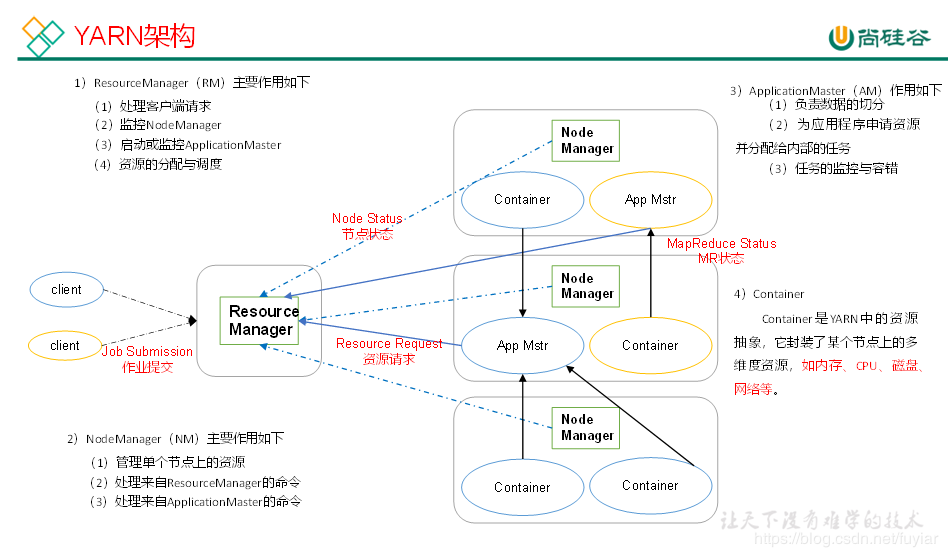
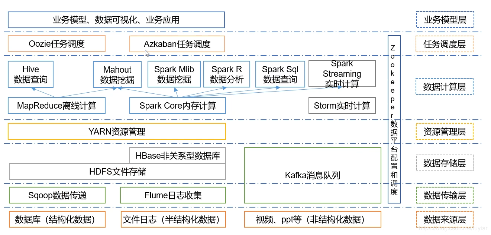

# 1.Hadoop介绍

1. 分布式架构基础架构
2. 解决海量数据的存储（HDFS）和数据分析计算（MapReduce）的问题

# 2.Hadoop的优势

1. 高可靠性：Hadoop底层维护多个数据副本，所以即使Hadoop某个计算元素活存储出现故障，也不会导致数据的丢失；
2. 高扩展性：在集群间分配任务数据，可方便的扩展数以千计的节点；
3. 高效性：在MapReduce的思想下，Hadoop是并行工作的，以加快任务处理速度；
4. 高容错性：能够自动将失败的任务重新分配。

# 3.Hadoop的组成

1. MapReduce(计算)
2. Yarn(资源调度)
3. HDFS(数据存储)

# 4.HDFS架构

1. NameNode（nn）：存储文件的元数据，如文件名，文件目录结构，文件属性（生成时间、副本数、文件权限），以及每个文件的块列表和块所在的DataNode等。
2. DataNode（dn）：在本地文件系统存储文件块数据，以及块数据校验和。
3. Secondary NameNode（2nn）：用来监控HDFS状态的辅助后台程序，每隔一段时间获取HDFS元数据的快照。

# 5.YARN架构

# 6.MapReduce架构

MapReduce将计算过程分为两个阶段：map和reduce

1. Map阶段并行处理输入数据；
2. Reduce阶段对Map结果进行汇总。

# 7.大数据技术生态体系

